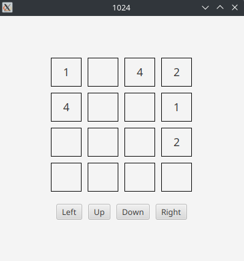

# 1024
This is a simple version of the game 1024. The game is played on a 4x4 grid, where the player can move the tiles in four directions: up, down, left, and right. The player can only move the tiles in one direction at a time, and all the tiles will move in that direction until they hit the edge of the grid or another tile. If two tiles with the same number collide, they will merge into a single tile with the sum of the two numbers. The goal of the game is to create a tile with the number 1024.


Use the arrow keys to move the tiles in the desired direction. The game will continue until the player reaches the goal of 1024 or there are no more moves left.

<div align="center">
  
</div>

## Prerequisites
* Ensure that git is installed on your machine. [Download Git](https://git-scm.com/downloads)
* Ensure that Gradle is installed on your machine. [Download Gradle](https://gradle.org/install/) (Recommend using SDKMAN to install Gradle [SDKMAN](https://sdkman.io/))

## Usage
To run the program, use the following commands:
```bash
./gradlew build
./gradlew run
```

## Testing
To run the tests, use the following command:
```bash
./gradlew test
```
